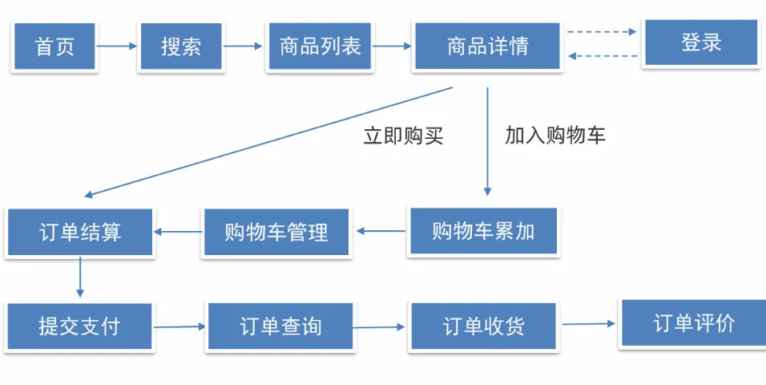

# Salted Fish
> 基于uni-app技术栈开发的，能够运行在多端(微信小程序、h5、ios/Android)的移动端商城项目

## 项目设置
安装项目依赖：
```
npm install
```
###  为开发环境编译和热重载
 为了在开发过程中实时预览修改效果，运行以下命令启动开发服务器：  
```
npm run serve
```
###  为生产环境编译和压缩  
 发布到生产环境前，编译和压缩项目文件，以优化项目性能： 
```
npm run build
```
###  Lint文件并修复  
 提高代码质量和规范性，使用以下命令对项目文件进行Lint处理和自动修复：  
```
npm run lint
```
###  自定义配置  
参阅 [Configuration Reference](https://cli.vuejs.org/config/).

## 项目说明
本项目实现了一个完整的电商购物平台，提供用户从浏览商品、添加购物车、下单到支付的一系列功能。具体包括：<br />（1）一个功能完备的电商购物流程，涵盖首页展示、商品搜索、商品详情、购物车管理、订单结算、支付和订单管理等模块。<br />（2）一个用户友好的界面和流畅的用户体验。<br />（3）使用 Vue.js 和相关技术，确保前端代码的高效和可维护性。
<a name="JBg7S"></a>

#### 具体功能

1. 用户管理：
   - 用户注册和登录功能。
   - 用户信息管理和密码修改功能。
2. 商品管理：
   - 商品的展示和搜索功能。
   - 商品分类和详情页面展示。
   - 商品的上架和下架管理。
3. 购物车管理：
   - 用户可以将商品添加到购物车。
   - 用户可以在购物车中修改商品数量或删除商品。
4. 订单管理：
   - 用户可以生成订单并进行支付。
   - 支持订单的查询和管理。
   - 订单的评价功能。
5. 支付功能：支持多种支付方式的集成与管理。
6. 售后服务：提供退换货申请和处理功能
<a name="E789r"></a>
#### 补充说明

- 测试环境：验证码功能未实装
   - 用户名：任意
   - 验证码：246810
- 下单商品后一分钟自动发货
- 没有实现后端代码，调用现有api库
<a name="GX8kz"></a>
### 功能图示：

